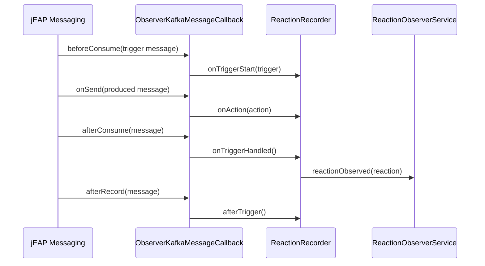

# How it works

The Reaction Observer records, per consumed message, how the service responds to it. The vocabulary is:

- **Observation** — a single message seen on Kafka, described by its `type` (`EVENT` or `COMMAND`),
  its fully-qualified name (message type, plus the variant if any) and a small set of properties
  (currently the `topic`). Each observation has a deterministic id derived from these values.
- **Trigger** — the observation of a *consumed* message that begins a reaction.
- **Action** — the observation of a message *produced* while handling a trigger.
- **Reaction** — a trigger together with the (de-duplicated, ordered) set of actions produced in
  response. A reaction has a stable `id` built from the trigger and action ids, so the same
  behavioural pattern always yields the same id.

## Recording flow

The observer plugs into jEAP Messaging through `ObserverKafkaMessageCallback`, a
`JeapKafkaMessageCallback`. Recording is per-thread (`ThreadLocal`) so concurrent consumers do not
interfere:

A message produced *outside* any trigger (e.g. by a scheduler) is recorded as an **action-only**
reaction. A trigger with no resulting actions is a **trigger-only** reaction.

The observer's own events (`ReactionIdentifiedEvent`, `ReactionsObservedEvent`) and
`MessageProcessingFailedEvent` are filtered out, so they are never observed as reactions.

## What gets published

`ReactionObserverService` does two things with each observed reaction:

1. **Identify** — the first time a reaction id is seen (after service-instance startup), a
   `ReactionIdentifiedEvent` is published to the `reaction-identified-topic`, carrying the full
   trigger/action structure of the new pattern.
2. **Count** — every observed reaction increments an in-memory counter keyed by reaction id.

On a schedule, `ReactionsObservedEventScheduler` drains the counters and publishes a single
`ReactionsObservedEvent` to the `reactions-observed-topic` with the per-reaction counts for the
elapsed timeframe (the interval is `observed-event-rate-seconds`, default 300s). If no reactions were
observed in a timeframe, no event is sent. A final event is also published on graceful shutdown.

## Best-effort and bounded by design

- Exceptions during recording are caught and logged, never propagated to business logic.
- At most `4096` distinct reactions and `100` actions per trigger are tracked; once a limit is
  reached a one-time warning is logged and further items are ignored, capping memory use.

## Related

- [Getting started](getting-started.md)
- [Configuration reference](configuration.md)
- [System behaviour documentation](system-behaviour-documentation.md)
